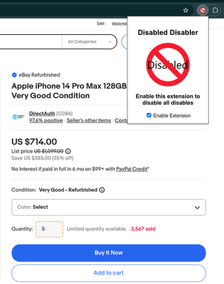

## Disabled Disabler

A Chrome extension that disables all disabled inputs and buttons on a page. You will see it working when buttons and inputs that are supposed to be disabled have an orange dotted outline around them.

## Installation

1. Download the extension and save the folder to your computer.
2. Open Chrome and go to `chrome://extensions`.
3. Enable "Developer mode" by clicking the toggle switch next to the address bar.
4. Click "Load unpacked" and select the folder you saved.